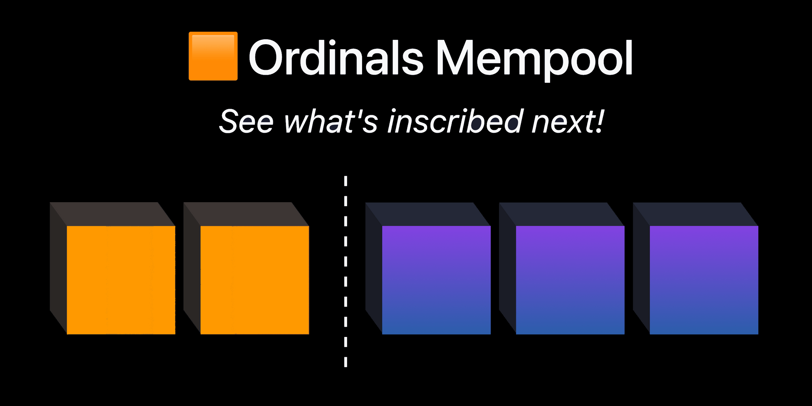

# Ordpool



Your favorite Bitcoin MEMEpool explorer.  
Inscriptions, Stamps, Runes, and 😺 CAT-21 Ordinals?  
We have you covered!  

This is a fork of the [The Mempool Open Source Project](https://github.com/mempool/mempool#the-mempool-open-source-project) – with significant changes for the Bitcoin Ordinals community.


## 🟧 Quick Setup for Backend Development

Get your Bitcoin node and Electrs ready!
You should have the following services already running:

- Bitcoin
- Electrs
- MariaDB

Read the [/backend/README.md](/backend/README.md) first.
Copy `mempool-config.sample.json` to `mempool-config.json and adjust all connection settings.

```sh
cd backend
npm install
npm start
```


## 🟧 Quick Setup for Frontend Development

Read the [/frontend/README.md](/frontend/README.md) first.
The key difference to the original setup is the following new command:


```sh
cd frontend
npm install
npm run config:defaults:ordpool
npm start
```

This generates the required file `/resources/config.js` with the correct settings for Ordpool.


## 🟧 ordpool-parser

We've extracted the parsing of digital artifacts to a separate repository! 
Now it's your turn! Fork it and add support for the next big metaprotocol.
Can't wait to see what you come up with! 🚀

More at: 
* https://github.com/ordpool-space/ordpool-parser
* https://www.npmjs.com/package/ordpool-parser

If you want to integrate the parser into your own project, feel free to do so.
The code is 100% open-source and is under the MIT License.
Do whatever you want with it!

<!--


# The Mempool Open Source Project®

https://user-images.githubusercontent.com/93150691/226236121-375ea64f-b4a1-4cc0-8fad-a6fb33226840.mp4

<br>

Mempool is the fully-featured mempool visualizer, explorer, and API service running at [mempool.space](https://mempool.space/). 

It is an open-source project developed and operated for the benefit of the Bitcoin community, with a focus on the emerging transaction fee market that is evolving Bitcoin into a multi-layer ecosystem.

# Installation Methods

Mempool can be self-hosted on a wide variety of your own hardware, ranging from a simple one-click installation on a Raspberry Pi full-node distro all the way to a robust production instance on a powerful FreeBSD server. 

Most people should use a <a href="#one-click-installation">one-click install method</a>.

Other install methods are meant for developers and others with experience managing servers. If you want support for your own production instance of Mempool, or if you'd like to have your own instance of Mempool run by the mempool.space team on their own global ISP infrastructure—check out <a href="https://mempool.space/enterprise" target="_blank">Mempool Enterprise®</a>.

<a id="one-click-installation"></a>
## One-Click Installation

Mempool can be conveniently installed on the following full-node distros: 
- [Umbrel](https://github.com/getumbrel/umbrel)
- [RaspiBlitz](https://github.com/rootzoll/raspiblitz)
- [RoninDojo](https://code.samourai.io/ronindojo/RoninDojo)
- [myNode](https://github.com/mynodebtc/mynode)
- [StartOS](https://github.com/Start9Labs/start-os)
- [nix-bitcoin](https://github.com/fort-nix/nix-bitcoin/blob/a1eacce6768ca4894f365af8f79be5bbd594e1c3/examples/configuration.nix#L129)

**We highly recommend you deploy your own Mempool instance this way.** No matter which option you pick, you'll be able to get your own fully-sovereign instance of Mempool up quickly without needing to fiddle with any settings.

## Advanced Installation Methods

Mempool can be installed in other ways too, but we only recommend doing so if you're a developer, have experience managing servers, or otherwise know what you're doing.

- See the [`docker/`](./docker/) directory for instructions on deploying Mempool with Docker.
- See the [`backend/`](./backend/) and [`frontend/`](./frontend/) directories for manual install instructions oriented for developers.
- See the [`production/`](./production/) directory for guidance on setting up a more serious Mempool instance designed for high performance at scale.

-->
